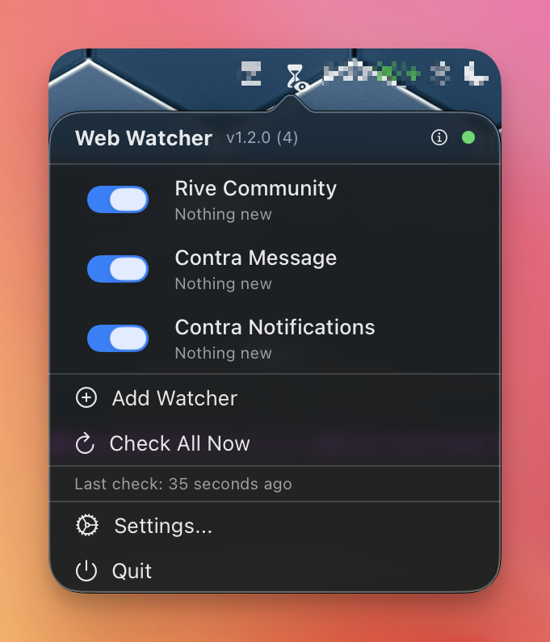
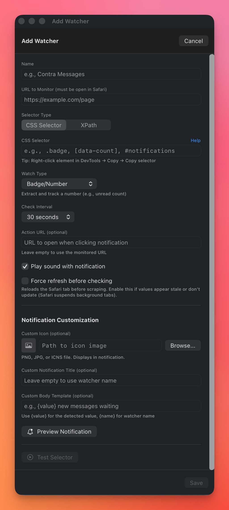
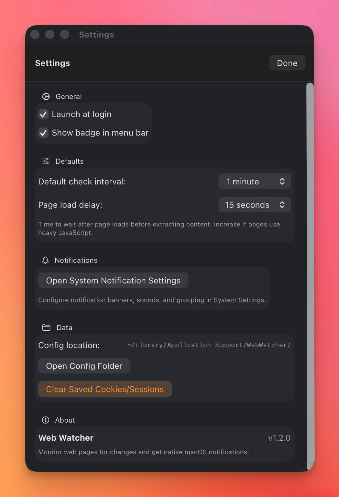

# WebWatcher

A macOS menu bar app that monitors websites for changes and sends native notifications.

https://github.com/user-attachments/assets/8adbf24e-0b20-4d1a-8bc1-d2593f2a02f7

## The problem

Notification badges get lost in browser tabs. Emails land in spam. Platform notifications assume you're checking constantly.

I missed a client message on Contra for two days because the badge was buried in 20 tabs. Built this to fix it.

## How it works

WebWatcher reads from Safari tabs you already have open. No separate login. No browser extension. It uses AppleScript to run JavaScript in your existing authenticated sessions, then pipes results to macOS Notification Center.



## Features

- **Menu bar app** - Lives in your menu bar, not the dock
- **Uses Safari sessions** - No re-login required. Reads from tabs you're already logged into
- **CSS selectors or XPath** - Monitor any element: badges, message counts, text changes
- **Smart filtering** - Only notifies when values change. Badge went 2 → 3? Notification. Still 3? Silence
- **Custom icons** - Set a different icon for each watcher so you know which platform pinged you
- **Configurable intervals** - Check every 15 seconds to 30 minutes
- **Native notifications** - Shows up in Notification Center with sound

## Privacy

**Everything stays on your machine.** No servers, no analytics, no data collection. Configuration is stored locally at `~/Library/Application Support/WebWatcher/watchers.json`. The app only talks to Safari via AppleScript. Nothing leaves your computer.

## Screenshots

### Adding a watcher



Configure the URL and notification preferences, then use **Scan page** or **Pick in Safari**
to fill in the element to watch — see [Finding the right selector](#finding-the-right-selector)
below.

### Settings



Launch at login and other preferences.

## Watch types

| Type | What it does |
|------|--------------|
| Badge/Number | Extract a numeric value (unread count, notification badge) |
| Element Count | Count how many elements match the selector |
| Text Change | Notify when text content changes |
| Element Exists | Notify when an element appears |
| Element Disappears | Notify when an element is removed |
| Anything Changes Inside | Notify when anything inside the element changes — a badge appears, text updates, items are added |

## Setup

1. Download the latest release
2. Move `WebWatcher.app` to Applications
3. Open the app (it appears in your menu bar)
4. Grant permissions when prompted (see below)
5. Open Safari and navigate to the page you want to monitor
6. Add a watcher with the URL and CSS selector

## Permissions

WebWatcher needs three permissions to work. macOS will prompt for most of these on first run.

### 1. Safari: Allow JavaScript from Apple Events

This is the most important one. Without it, WebWatcher can't read page content.

1. Open **Safari**
2. Go to **Safari → Settings** (or Preferences on older macOS)
3. Click the **Advanced** tab
4. Check **Show features for web developers** (this enables the Develop menu)
5. Close Settings, then go to **Develop** menu in the menu bar
6. Check **Allow JavaScript from Apple Events**

If you skip this step, watchers will fail with: "Enable 'Allow JavaScript from Apple Events' in Safari Settings → Developer"

### 2. Automation (System Events & Safari)

macOS will show permission dialogs asking if WebWatcher can control Safari and System Events. Click **OK** on both.

If you accidentally clicked "Don't Allow":
1. Open **System Settings → Privacy & Security → Automation**
2. Find **WebWatcher** in the list
3. Enable both **Safari** and **System Events**

### 3. Notifications

macOS prompts for notification permission on first run. If you want to change settings later:

1. Open **System Settings → Notifications**
2. Find **WebWatcher**
3. Enable notifications and choose your preferred alert style (Banners or Alerts)

## Finding the element

The watcher editor walks you through three steps — **Page → Element → Confirm** — so you
shouldn't need DevTools at all:

1. **Page** — paste or edit the URL. WebWatcher finds the matching Safari tab itself (opening
   it if it isn't already open) and reports what it found: "Found in Safari: Feed | Rive
   Community".
2. **Element** — WebWatcher scans the page automatically and groups what it finds ("Showing a
   number now", "Could get a badge later", "Other"). Click **Use** on a row, or click
   **Pick in Safari** and click the element yourself. Once picked, you can refine the
   selection without leaving Safari: **↑** selects the parent, **↓** the first child, **←**/**→**
   move between siblings, **Enter** confirms, **Esc** cancels. A toolbar in Safari shows the
   same shortcuts, or use the app's own **Use this** button, which always works even if the
   page blocks scripted keys. If an element shows a number, WebWatcher recommends tracking it;
   if it doesn't show anything yet, it offers "a number appears next to it" or "anything
   changes inside it".
3. **Confirm** — a summary of what will be watched, plus the live diagnosis (current reading,
   confirmed zero, background tab, etc.) and buttons to test again or change the element.

**Anything Changes Inside** is the watch type for elements that show no count at all — a bell
icon with no badge, a status area, anything where "something happened" is all you need. It
fingerprints the element's subtree and notifies when that fingerprint changes. Caveat: a busy
container (lots of descendants, frequently-updating timestamps, live counters unrelated to
what you care about) can notify more often than you want — WebWatcher warns you in the Confirm
step when the picked area has a large number of elements, and picking a smaller part (with
↑/↓ while picking) usually fixes it.

If neither helper finds what you need, the manual fallback is still there under **Advanced**:
open Safari → Develop → Show Web Inspector, click the element inspector tool, click the
element you want to monitor, then right-click it → Copy → Copy Selector, and paste the result
into the Selector field.

## Example watchers

**Contra messages:**
- URL: `https://contra.com/messages`
- Selector: `[data-sentry-component='Messages'] [class*='badge']`
- Watch type: Badge/Number

**Reddit notifications:**
- URL: `https://www.reddit.com/`
- Selector: `dynamic-badge[data-id="notification-count-element"]`
- Watch type: Badge/Number
- Badge Attribute: `initial-count`
- Note: Reddit uses web components with Shadow DOM, so the badge value is in an attribute

**LinkedIn notifications:**
- URL: `https://www.linkedin.com/feed/`
- Selector: `.notification-badge__count`
- Watch type: Badge/Number

**Rive Community:**
- URL: `https://community.rive.app/`
- Selector: `.notification-indicator, [class*='notification'] [class*='count']`
- Watch type: Badge/Number
- This is a built-in recipe — pick the Rive site profile in the editor and WebWatcher fills
  these fields for you, including the `anchoredBadge` strategy (the badge node disappears
  entirely at zero, which the built-in recipe already accounts for).

**GitHub PR reviews:**
- URL: `https://github.com/notifications`
- Selector: `.notification-indicator`
- Watch type: Element Exists

## Force refresh

Safari suspends background tabs to save resources. If your watcher shows stale values, enable "Force refresh before checking" in the watcher settings. This reloads the tab before scraping.

The "Settle delay" option (0.5s - 5.0s) controls how long to wait after reload for dynamic JavaScript content to update.

### Known limitations

- **Private windows** can't be told apart from normal ones — WebWatcher probes the first
  matching Safari tab regardless of whether it's in a private window.
- **Cross-origin iframes**: an element embedded inside a frame from a different origin can't
  be reached by Scan page or Pick in Safari. Pick in Safari tells you when this happens.
- **Closed shadow roots**: elements inside a closed Shadow DOM aren't visible to the assistant
  either, for the same cross-boundary reason.
- **Background tabs go stale.** Safari pauses rendering in hidden tabs, so a badge that
  updates over a WebSocket may not repaint until the tab is visible again. Badge watchers
  reload the tab before reading it; if a watcher still looks stale, turn on **Force refresh**
  under Advanced.

## Gmail

WebWatcher can also watch for new mail from specific senders or domains — arriving in the
Inbox — and notify you the moment it lands.

### Setup

Click **Add Gmail Account** (or **Sign in with Google** in the Gmail sender editor), sign in,
allow access — done. WebWatcher uses its own built-in Google OAuth client, so there's no
console or JSON step for most people.

Then use **Add Watcher → Gmail sender**: pick the connected account, add one or more sender
addresses or `@domain.com` patterns, and save.

#### Advanced: use your own Google OAuth client

If you'd rather not rely on WebWatcher's built-in client — or you're building from source
without one bundled — you can import your own:

1. Open **Google Cloud Console → APIs & Services → Credentials**
   (https://console.cloud.google.com/apis/credentials).
2. **Create Credentials → OAuth client ID → Application type: Desktop app → Create → Download JSON.**
3. Enable the **Gmail API** for that project
   (https://console.cloud.google.com/apis/library/gmail.googleapis.com).
4. On the **OAuth consent screen**: if your Google Cloud project belongs to a Google Workspace
   organization, choose **Internal**. Otherwise choose **External** and add yourself under
   **Test users** — while the app is in Testing, Google revokes access every 7 days and you'll
   need to reconnect the account in WebWatcher's Settings.
5. In WebWatcher, go to **Settings → Gmail → Advanced: use your own Google OAuth client** and
   import the JSON file you downloaded. An imported client always takes priority over the
   built-in one; remove it from the same panel to go back to the built-in client.

### Notifications

Each email watcher keeps a live **unread count**: every check asks Gmail for unread Inbox mail
from the watched senders, so reading a message in Gmail lowers the count on the next check.
The menu shows the count next to the watcher.

New mail produces **one notification per watcher** that is replaced in place rather than
stacking: "2 new from Acme Billing", the latest subjects, and when the newest one arrived.
Clicking it opens the email itself when there is one unread message, or a Gmail search for the
unread mail from those senders when there are several. **Mark as Read**, **Archive**, **Delete**
and **Spam** act on all counted messages.

The watcher's **Notification** section lets you set a custom icon, title and body. Templates
can use `{count}`, `{sender}`, `{address}`, `{subject}`, `{time}` and `{name}`; the defaults are
`{count} new from {sender}` (or `Email from {sender}` for a single message) and the latest
subjects followed by `received {time}`.

### Notify for every new email

Each connected account also has a **"Notify for every new email"** toggle in Settings. Turn
it on to get notified about every Inbox message from that account, not just the senders
you've set up watchers for.

### Limitations

- Only mail that lands in the **Inbox** is seen — archived, spam, and other-label messages
  aren't watched.
- Gmail accounts only; other mail providers aren't supported.
- Domain watchers (`@company.com`) establish their starting point with a search query that
  can, in rare cases, miss a message that should have matched — new mail from that domain is
  still caught going forward.

## Herald (optional)

WebWatcher can deliver its notifications through [Herald](https://github.com/ivg-design/herald),
a standalone menu-bar notification service with persistent, always-on-top banners, per-app history,
stacking by sender, snooze, and fully customizable banner layouts. When Herald is running, WebWatcher
registers two issuers (`webwatcher.web` for page watchers, `webwatcher.email` for Gmail watchers) and
sends banners with the same title, body, icon and buttons it would otherwise hand to macOS. Buttons
such as Open, Mark as Read, Archive and Delete call back into WebWatcher and report their outcome, so
a banner is only dismissed once the action succeeded.

Settings → Notifications → **Delivery** chooses between **Herald when available** (default; falls
back to macOS notifications when Herald is not running) and **macOS notifications**.

## Requirements

- macOS 13.0+
- Safari with "Allow JavaScript from Apple Events" enabled (see Permissions above)
- Target page open in a Safari tab
- Automation permissions for Safari and System Events
- Notification permissions (optional, but recommended)

## Troubleshooting

**"Enable 'Allow JavaScript from Apple Events' in Safari Settings → Developer"**

Safari's JavaScript access is disabled. See Permissions section above.

**"Tab not found. Open [URL] in Safari."**

The page isn't open in Safari, or the URL doesn't match. Make sure:
- The page is open in a Safari tab (not just bookmarked)
- The URL in your watcher matches what's in Safari's address bar
- You're not in Private Browsing mode

**"Not permitted to send Apple events to Safari"**

macOS blocked automation access. Go to System Settings → Privacy & Security → Automation → WebWatcher and enable Safari.

**Watcher shows stale/unchanging values**

Safari suspends background tabs. Enable "Force refresh before checking" in the watcher settings.

**No notifications appearing**

Check System Settings → Notifications → WebWatcher. Make sure notifications are enabled and set to Banners or Alerts (not "None").

## Building from source

```bash
cd WebWatcher
swift build
```

Or open `WebWatcher.xcodeproj` in Xcode and build.

The build works out of the box, but without a Google client "Add Gmail Account" falls back to
the Advanced import (see above). To get built-in Google sign-in in your own build, download a
Desktop-app OAuth client JSON from Google Cloud Console (see Advanced above) and install it
with:

```bash
scripts/install-google-client.sh /path/to/client_secret_*.json
```

This copies the JSON to `Sources/WebWatcher/Resources/google-oauth-client.json`, a path that's
gitignored so it never gets committed. Rebuild after installing it.

## License

MIT
